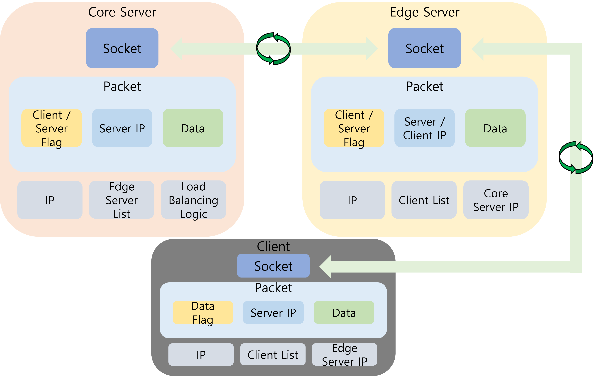
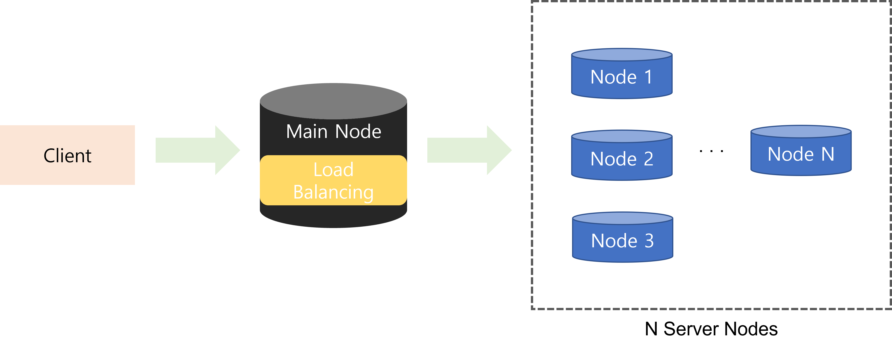

# Capstone-Design2
2022학년도 2학기 경희대학교 컴퓨터공학과 캡스톤디자인2 

주제: **대규모 메타버스 사용자 상호작용을 위한 분산 클라우드 기술**

 *본 연구는 과학기술정보통신부 및 정보통신기획평가원의 SW중심대학 사업의 연구결과로 수행되었음(2017-0-00093)

------------------------

## 연구 배경

캡스톤 디자인1에서 진행한 ‘메타버스 기반 실감형 아바타 생성 기술 및  인간 아바타 상호작용 매칭 분산 시스템 개발’ 연구에서 단일 서버 사용 시 대규모 사용자의 데이터를 처리할 능력이 없음을 보임.

따라서 메타버스 환경에서 분산 서버의 필요성을 확인 했고, 더불어 서버의 부하를 줄여줄 기능의 필요성을 느낌.

## 본론
### 분산 서버 구조 제안

  

이는 전반적인 메타버스 분산 서버 아키텍처임. 기본적으로 Core(Master), Edge, Client의 3계층 구조로 서버를 구성함. 

Core는 기본적으로 Edge를 관리하는 총괄 노드의 역할을 수행 함. 새로운 Edge 노드가 실행될 때마다 Edge 노드의 정보(Ip, Socket, etc..)를 List로 관리 함. 또한, Client가 서버에 연결하고자 할 때, Load Balancer Logic을 가지고 있어서 최적의 Edge 노드를 연결해 줄 수 있음.

Edge는 Client와 직접적으로 연결되는 노드로 Client 패킷의 정보를 제어하고 관리함. 각 Edge 노드에 붙어있는 Client의 패킷을 동기화하고, Core로의 데이터 동기화를 통해 모든 Client간 정보 동기화를 진행할 수 있음.

Client는 메타버스 사용자의 위치, 정보 등을 데이터로 활용하는 메타버스 클라이언트의 역할. 즉, 각종 사용자 정보를 패킷에 담아 연결된 Edge서버로 전송하고 다른 사용자의 정보를 실시간으로 받음.

### 로드밸런싱 구조 제안

서버에 연결하는 Client는 Main 노드인 Core에 연결 됨. 이 때, 로드밸런싱 로직이 Edge 노드 List를 탐색해 알고리즘에 따라 가장 적절한 Edge 노드를 Client에 연결 해줌.

**Load Balancing Algorithms**
- Random Match Algorithm
- Round Robin Algorithm
- Best Response Algorithm
- Least Connection Algorithm
- .....

다양한 로드밸런싱 알고리즘이 존재. 메타버스 환경에서 이러한 알고리즘을 활용해 부하를 최적화 하고자 함.

## 서버 동작

실제 메타버스 환경에서 주고받는 Packet으로 데이터를 만들고 Server의 동작을 로그화 한 것임.

Local에서 Core와 Edge 서버를 동작할 때의 로그 결과.

## 결론
### 실험

**실험 방법**
1. 1개의 Core와 5개의 Edge 노드를 쿨라우드 환경에서 실행한다.
2. Client를 0개, 20개, 50개, 100개, 125개, 150개, 200개 실행한다.
3. 이 때 서버의 응답시간을 각각 측정하고 평균 응답 시간을 기록한다.
4. 다양한 알고리즘 별로 1-3 실험을 동일하게 진행한다.

### 실험 결과

최소 연결 알고리즘의 응답시간이 가장 빠른 것으로 나타남. 이어서 라운드로빈, 최적 응답시간, 랜덤 알고리즘 순서로 응답시간이 빨랐음.

따라서, 대규모 메타버스 사용자를 위한 분산 클라우드 최적의 알고리즘은 Least Connection 알고리즘인 최소 연결 알고리즘임.

## 요약

- 메타버스 환경에 분산 서버를 활용해 **대규모 사용자 연결을 보장**함
- **최소 연결 알고리즘**을 사용한 로드밸런싱으로 메타버스 환경의 부하를 최적화 가능